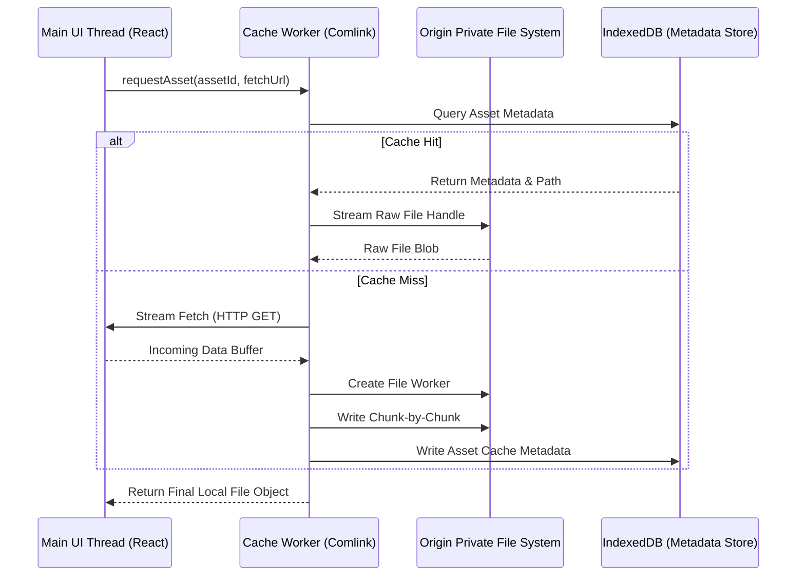

# OPFS Media Cache 💾

A high-performance, multi-threaded client-side caching and local storage engine utilizing the modern **Origin Private File System (OPFS)**. This library enables web applications to store gigabytes of large media assets (videos, PSDs, high-res images) locally in the client’s browser with near-native read/write speeds, while keeping the main UI thread completely unblocked.

## 🚀 Key Features

- **Origin Private File System (OPFS):** Utilizes the modern highly optimized browser filesystem API for reading and writing large binary files directly.
- **Worker-Thread Isolation:** Offloads intensive file operations to a background Web Worker utilizing `Comlink` for RPC, preserving silky smooth 60 FPS interfaces.
- **Robust LRU Eviction Policy:** Monitors storage sizes and automatically evicts oldest cached assets when hitting a user-defined max storage limit (e.g., 2GB).
- **Concurrency & Lock Guarding:** Handles concurrent fetch and write requests with custom file-locking queues to prevent corruption during simultaneous page reads.
- **Fast Resilient Retries:** Automatically recovers and retries operations during temporary lock failures, standardizing error codes across browsers.

## 🛠️ Thread Isolation & Architecture



## 📦 Tech Stack

- **Core Storage:** Origin Private File System (OPFS) via `opfs-tools`
- **Multi-Threading:** Web Workers & `comlink` (RPC orchestration)
- **Metadata Management:** IndexedDB (for quick key-value querying)
- **Framework & Testing:** TypeScript, Vite, Vitest, Yarn v4 (Berry)

## ⚙️ Setup & Installation

This project utilizes advanced browser features and requires modern secure contexts (HTTPS or localhost).

```bash
# Clone and enter directory
git clone https://github.com/KhoaTheBest/opfs-media-cache.git
cd opfs-media-cache

# Install dependencies (Yarn v4 setup)
yarn install

# Run Vite dev environment with examples
yarn dev

# Run Vitest test suite
yarn test
```

## 💡 Engineering Highlights & Optimizations

- **Blocking Avoidance:** Abstracted complex reader/writer APIs into high-level Comlink callbacks. Developers interact with simple async functions, while the main thread avoids any heavy serialization work.
- **Chunk-Based Writing:** Files are written to disk in chunks rather than loaded as a whole into RAM, preventing browser memory footprint spikes.
